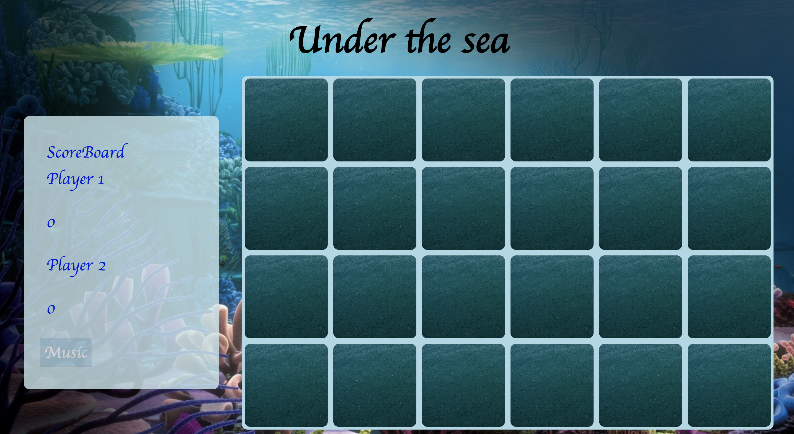
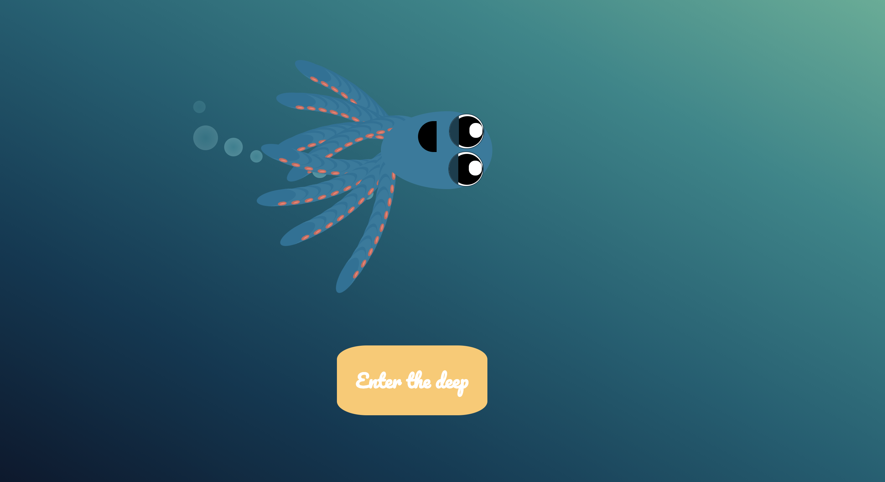

# wdi-project-one
# Under the Sea: a child's memory game


Under the Sea is a game designed to test the memory of its users. It is a two player game in which all of the cards are laid face down on a surface and two cards are flipped face over. The object of the game is to turn over more matching pairs than your opponent.

## Instructions

Each player clicks on two cards. If they get a match they are allowed to go again. If there is no match then it reverts to the previous players turn.

# Title Page

The interface of the game is child-like and educational.

.

The welcome to the page offers some light relief from the educational stance of the game.

.

# Technologies used

* HTML
* Javacript
* CSS animation
* Git and GitHub
* Google Fonts

# Project Brief

The brief was to create a grid based logic game with two players. The technical requirements were as follows:

* Render a game in the browser.
* Switch turns between two players.
* Design logic for winning & visually display which player won.
* Include separate HTML / CSS / JavaScript files
* Stick with KISS (Keep It Simple Stupid) and DRY (Don’t Repeat Yourself) principles.
* Use Javascript or jQuery for DOM manipulation.
* Deploy your game online, using Github Pages, where the rest of the world can access it.
* Use semantic markup for HTML and CSS (adhere to best practices).

# How I tackled my project

Since this was my first project I was determined to utilise areas of javascript that I was not that comfortable with.

This included:
* Arrow functions
* Objects
* Arrays
* Creating HTML elements in JavaScript

So I planned a simple logic one player game that incorporated all these areas and then added to it from there.

A particular piece of code that I am proud of is the duplication of my matching pairs. I created an array of objects and then used the concat method to duplicate the array and then shuffled it.

The code can be seen below:
``` const gameGrid = cardsArray.concat(cardsArray);
const shuffledArray = gameGrid.sort(() => 0.5 - Math.random());
```

# Wins and challenges

By far the biggest win for me was getting a functioning game working. Getting my head around functions, arrays and objects and then using them was a huge challenge that I did manage to overcome.

My biggest challenge took me slightly by surprise which was the styling of the game. I found using CSS and CSS animation much harder than expected. 
